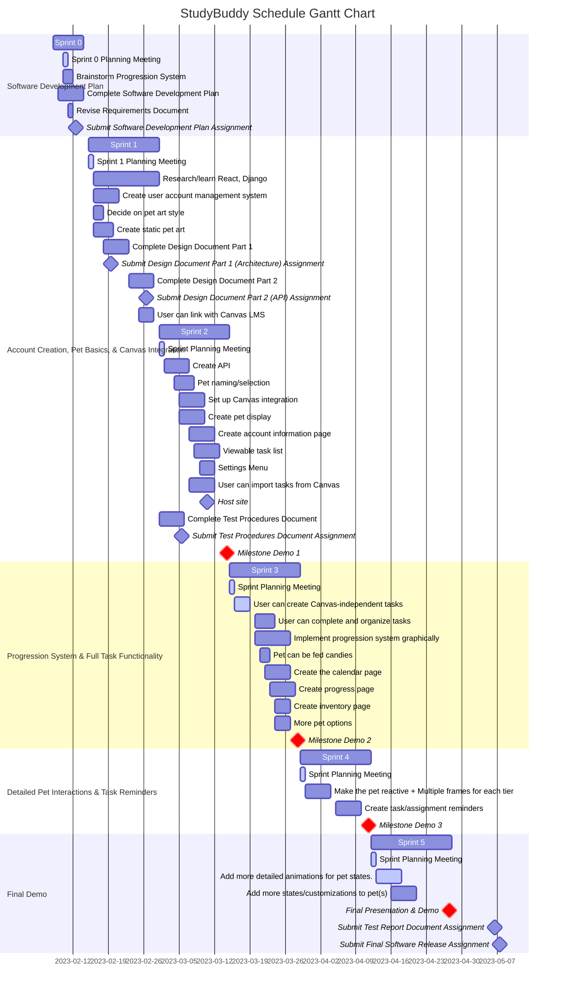

# Schedule

```mermaid
gantt
    title StudyBuddy Schedule Gantt Chart
    todayMarker stroke-width:10px,stroke:#0f0,opacity:0.4
    dateFormat  YYYY-MM-DD
        section Software Development Plan
        Sprint 0: , 2023-02-08, 6d
        section Software Development Plan
        Sprint 0 Planning Meeting: active, 2023-02-10, 1d
        section Software Development Plan
        Brainstorm Progression System: , 2023-02-10, 2d
        section Software Development Plan
        Complete Software Development Plan: , 2023-02-09, 5d
        section Software Development Plan
        Revise Requirements Document: , 2023-02-11, 1d
        section Software Development Plan
        Submit Software Development Plan Assignment: milestone, 2023-02-12, 1d

        section Account Creation, Pet Basics, & Canvas Integration
        Sprint 1: , 2023-02-15, 2w
        section Account Creation, Pet Basics, & Canvas Integration
        Sprint 1 Planning Meeting: active, 2023-02-15, 1d
        section Account Creation, Pet Basics, & Canvas Integration
        Research/learn React, Django:  , 2023-02-16, 13d
        section Account Creation, Pet Basics, & Canvas Integration
        Create user account management system:  , 2023-02-16, 5d
        section Account Creation, Pet Basics, & Canvas Integration
        Decide on pet art style:  , 2023-02-16, 2d
        section Account Creation, Pet Basics, & Canvas Integration
        Create static pet art:  , 2023-02-16, 4d
        section Account Creation, Pet Basics, & Canvas Integration
        Complete Design Document Part 1:  , 2023-02-18, 5d
        section Account Creation, Pet Basics, & Canvas Integration
        Submit Design Document Part 1 (Architecture) Assignment: milestone, , 2023-02-19, 1d
        section Account Creation, Pet Basics, & Canvas Integration
        Complete Design Document Part 2:  , 2023-02-23, 5d
        section Account Creation, Pet Basics, & Canvas Integration
        Submit Design Document Part 2 (API) Assignment: milestone, , 2023-02-26, 1d
        section Account Creation, Pet Basics, & Canvas Integration
        User can link with Canvas LMS:  , 2023-02-25, 3d

        
        section Account Creation, Pet Basics, & Canvas Integration
        Sprint 2: , 2023-03-01, 2w
        section Account Creation, Pet Basics, & Canvas Integration
        Sprint Planning Meeting: active, 2023-03-01, 1d
        section Account Creation, Pet Basics, & Canvas Integration
        Create API: , 2023-03-02, 5d
        section Account Creation, Pet Basics, & Canvas Integration
        Pet naming/selection: , 2023-03-04, 4d
        section Account Creation, Pet Basics, & Canvas Integration
        Set up Canvas integration: , 2023-03-05, 5d
        section Account Creation, Pet Basics, & Canvas Integration
        Create pet display : , 2023-03-05, 5d
        section Account Creation, Pet Basics, & Canvas Integration
        Create account information page : , 2023-03-07, 5d
        section Account Creation, Pet Basics, & Canvas Integration
        Viewable task list : , 2023-03-08, 5d
        section Account Creation, Pet Basics, & Canvas Integration
        Settings Menu : , 2023-03-09, 3d
        section Account Creation, Pet Basics, & Canvas Integration
        User can import tasks from Canvas: , 2023-03-07, 5d
        section Account Creation, Pet Basics, & Canvas Integration
        Host site: milestone, , 2023-03-09, 3d
        section Account Creation, Pet Basics, & Canvas Integration
        Complete Test Procedures Document: , 2023-03-01, 5d
        section Account Creation, Pet Basics, & Canvas Integration
        Submit Test Procedures Document Assignment: milestone, , 2023-03-05, 1d
        section Account Creation, Pet Basics, & Canvas Integration
        Milestone Demo 1 :crit, milestone,  , 2023-03-14, 1d

        section Progression System & Full Task Functionality
        Sprint 3: , 2023-03-15, 2w
        section Progression System & Full Task Functionality
        Sprint Planning Meeting: active , 2023-03-15, 1d
        section Progression System & Full Task Functionality
        User can create Canvas-independent tasks: active , 2023-03-16, 3d
        section Progression System & Full Task Functionality
        User can complete and organize tasks: , 2023-03-20, 4d
        section Progression System & Full Task Functionality
        Implement progression system graphically: , 2023-03-20, 1w
        section Progression System & Full Task Functionality
        Pet can be fed candies: , 2023-03-21, 2d
        section Progression System & Full Task Functionality
        Create the calendar page: , 2023-03-22, 5d
        section Progression System & Full Task Functionality
        Create progress page: , 2023-03-23, 5d
        section Progression System & Full Task Functionality
        Create inventory page: , 2023-03-24, 3d
        section Progression System & Full Task Functionality
        More pet options: , 2023-03-24, 3d
        section Progression System & Full Task Functionality
        Milestone Demo 2 :crit, milestone,  , 2023-03-28, 1d

        
        section Detailed Pet Interactions & Task Reminders
        Sprint 4: , 2023-03-29, 2w
        section Detailed Pet Interactions & Task Reminders
        Sprint Planning Meeting: active , 2023-03-29, 1d
        section Detailed Pet Interactions & Task Reminders
        Make the pet reactive + Multiple frames for each tier: , 2023-03-30, 5d
        section Detailed Pet Interactions & Task Reminders
        Create task/assignment reminders: , 2023-04-05, 5d
        section Detailed Pet Interactions & Task Reminders
        Milestone Demo 3 :crit, milestone,  , 2023-04-11, 1d

        section Final Demo
        Sprint 5: , 2023-04-12, 16d
        section Final Demo
        Sprint Planning Meeting: active , 2023-04-12, 1d
        section Final Demo
        Add more detailed animations for pet states.: active , 2023-04-13, 5d
        section Final Demo
        Add more states/customizations to pet(s): , 2023-04-16, 5d
        section Final Demo
        Final Presentation & Demo :crit, milestone,  , 2023-04-27, 1d
        section Final Demo
        Submit Test Report Document Assignment: milestone, , 2023-05-06, 1d
        section Final Demo
        Submit Final Software Release Assignment: milestone, , 2023-05-07, 1d
```
