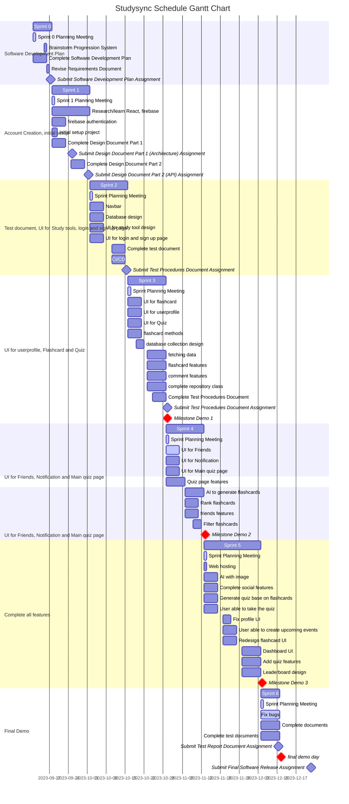

# Schedule

## Gantt Chart

```mermaid
gantt
    title Studysync Schedule Gantt Chart
    todayMarker stroke-width:10px,stroke:#0f0,opacity:0.4
    dateFormat  YYYY-MM-DD
        section Software Development Plan
        Sprint 0: , 2023-09-11, 1w
        section Software Development Plan
        Sprint 0 Planning Meeting: active, 2023-09-11, 1d
        section Software Development Plan
        Brainstorm Progression System: , 2023-09-15, 1d
        section Software Development Plan
        Complete Software Development Plan: , 2023-09-11, 5d
        section Software Development Plan
        Revise Requirements Document: , 2023-09-16, 1d
        section Software Development Plan
        Submit Software Development Plan Assignment: milestone, 2023-09-17, 1d

        section Account Creation, initial setup
        Sprint 1: , 2023-09-18, 2w
        section Account Creation, initial setup
        Sprint 1 Planning Meeting: active, 2023-09-18, 1d
        section Account Creation, initial setup
        Research/learn React, firebase:  , 2023-09-18, 2w
        section Account Creation, initial setup
        firebase authentication:  , 2023-09-18, 5d
        section Account Creation, initial setup
        initial setup project:  , 2023-09-18, 2d
        section Account Creation, initial setup
        Complete Design Document Part 1:  , 2023-09-18, 5d
        section Account Creation, initial setup
        Submit Design Document Part 1 (Architecture) Assignment: milestone, , 2023-09-25, 1d
        section Account Creation, initial setup
        Complete Design Document Part 2:  , 2023-09-25, 5d
        section Account Creation, initial setup
        Submit Design Document Part 2 (API) Assignment: milestone, , 2023-10-01, 1d

        section Test document, UI for Study tools, login and sign up page
        Sprint 2: , 2023-10-02, 2w
        section Test document, UI for Study tools, login and sign up page
        Sprint Planning Meeting: active, 2023-10-02, 1d
        section Test document, UI for Study tools, login and sign up page
        Navbar: , 2023-10-02, 5d
        section Test document, UI for Study tools, login and sign up page
        Database design: , 2023-10-02, 5d
        section Test document, UI for Study tools, login and sign up page
        UI for study tool design: , 2023-10-02, 5d
        section Test document, UI for Study tools, login and sign up page
        UI for login and sign up page : , 2023-10-02, 5d
        section Test document, UI for Study tools, login and sign up page
        Complete test document : , 2023-10-10, 5d
        section Test document, UI for Study tools, login and sign up page
        CI/CD : , 2023-10-10, 5d
        section Test document, UI for Study tools, login and sign up page
        Submit Test Procedures Document Assignment: milestone, , 2023-10-15, 1d
        
        section UI for userprofile, Flashcard and Quiz
        Sprint 3: , 2023-10-16, 2w
        section UI for userprofile, Flashcard and Quiz
        Sprint Planning Meeting: active, 2023-10-16, 1d
        section UI for userprofile, Flashcard and Quiz
        UI for flashcard: , 2023-10-16, 5d
        section UI for userprofile, Flashcard and Quiz
        UI for userprofile: , 2023-10-16, 5d
        section UI for userprofile, Flashcard and Quiz
        UI for Quiz: , 2023-10-16, 5d
        section UI for userprofile, Flashcard and Quiz
        flashcard methods : , 2023-10-16, 5d
        section UI for userprofile, Flashcard and Quiz
        database collection design : , 2023-10-19, 3d
        section UI for userprofile, Flashcard and Quiz
        fetching data : , 2023-10-23, 1w
        section UI for userprofile, Flashcard and Quiz
        flashcard features : , 2023-10-23, 1w
        section UI for userprofile, Flashcard and Quiz
        comment features: , 2023-10-23, 1w
        section UI for userprofile, Flashcard and Quiz
        complete repository class: , 2023-10-23, 1w
        section UI for userprofile, Flashcard and Quiz
        Complete Test Procedures Document: , 2023-10-25, 5d
        section UI for userprofile, Flashcard and Quiz
        Submit Test Procedures Document Assignment: milestone, , 2023-10-30, 1d
        section UI for userprofile, Flashcard and Quiz
        Milestone Demo 1 :crit, milestone,  , 2023-10-30, 1d

        section UI for Friends, Notification and Main quiz page 
        Sprint 4: , 2023-10-30, 2w
        section UI for Friends, Notification and Main quiz page 
        Sprint Planning Meeting: active , 2023-10-30, 1d
        section UI for Friends, Notification and Main quiz page 
        UI for Friends: active , 2023-10-30, 5d
        section UI for Friends, Notification and Main quiz page 
        UI for Notification: , 2023-10-30, 5d
        section UI for Friends, Notification and Main quiz page 
        UI for Main quiz page: , 2023-10-30, 5d
        section UI for Friends, Notification and Main quiz page
        Quiz page features: , 2023-10-30, 1w
        section UI for Friends, Notification and Main quiz page 
        AI to generate flashcards: , 2023-11-06, 1w
        section UI for Friends, Notification and Main quiz page 
        Rank flashcards: , 2023-11-06, 5d
        section UI for Friends, Notification and Main quiz page 
        friends features: , 2023-11-06, 5d
        section UI for Friends, Notification and Main quiz page 
        Filter flashcards : , 2023-11-09, 3d
        section UI for Friends, Notification and Main quiz page 
        Milestone Demo 2 :crit, milestone,  , 2023-11-13, 1d

        section Complete all features
        Sprint 5: , 2023-11-13, 3w
        section Complete all features
        Sprint Planning Meeting: active , 2023-11-13, 1d
        section Complete all features
        Web hosting: , 2023-11-13, 1d
        section Complete all features
        AI with image: , 2023-11-13, 5d
        section Complete all features
        Complete social features: , 2023-11-13, 5d
        section Complete all features
        Generate quiz base on flashcards: , 2023-11-13, 5d
        section Complete all features
        User able to take the quiz :, 2023-11-13, 5d
        section Complete all features
        Fix profile UI: , 2023-11-20, 3d
        section Complete all features
        User able to create upcoming events: , 2023-11-20, 5d
        section Complete all features
        Redesign flashcard UI: , 2023-11-20, 5d
        section Complete all features
        Dashboard UI: , 2023-11-27, 1w
        section Complete all features
        Add quiz features: , 2023-11-27, 1w
        section Complete all features
        Leaderboard design: , 2023-11-27, 1w
        section Complete all features
        Milestone Demo 3 :crit, milestone,  , 2023-12-04, 1d

        section Final Demo
        Sprint 6: , 2023-12-04, 1w
        section Final Demo
        Sprint Planning Meeting: active , 2023-12-04, 1d
        section Final Demo
        Fix bugs: active , 2023-12-04, 1w
        section Final Demo
        Complete documents: , 2023-12-04, 1w
        section Final Demo
        Complete test documents: , 2023-12-04, 1w
        section Final Demo
        Submit Test Report Document Assignment: milestone, , 2023-12-10, 1d
        section Final Demo
        final demo day:crit, milestone, , 2023-12-11, 1d
        section Final Demo
        Submit Final Software Release Assignment: milestone, , 2023-12-22, 1d

```
