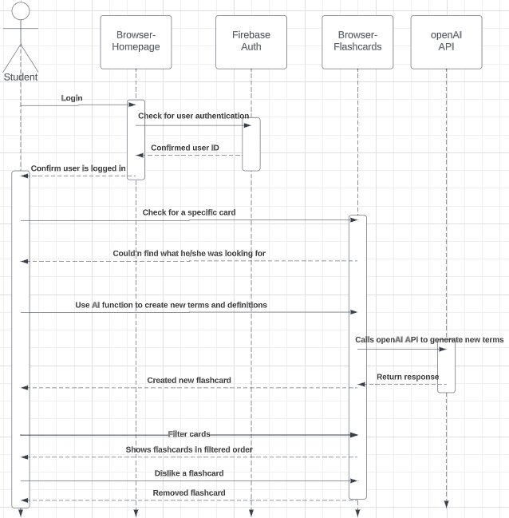
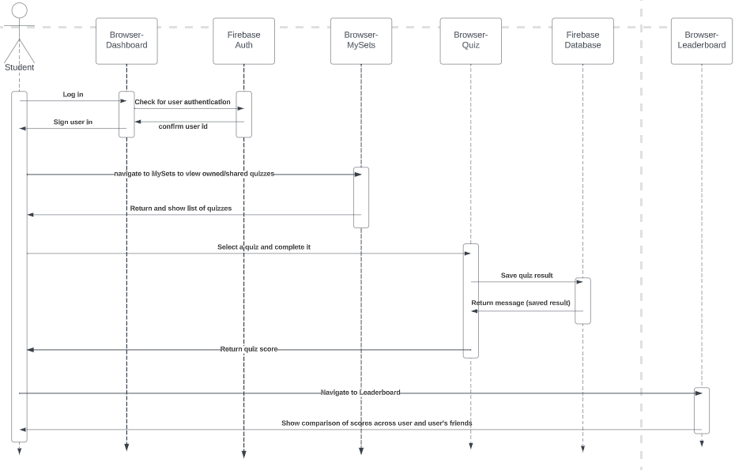
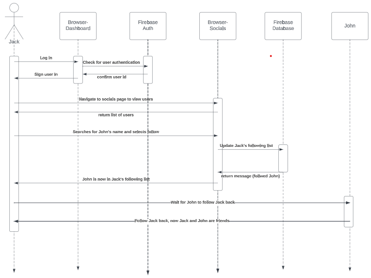
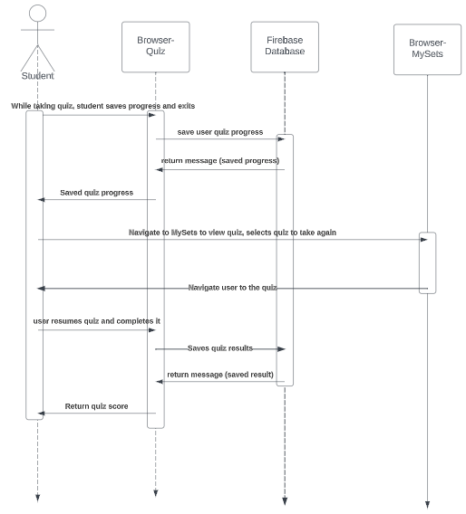
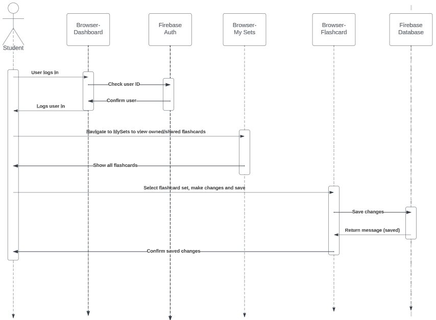

## Client

The StudySync web interface offers a user-centric dashboard that centralizes learning tools, friend interactions, and personalized notifications. After logging in, users can access a suite of study tools, view and interact with friends' content, receive system and friend notifications, and manage their profile, all seamlessly interconnected for an efficient and engaging learning experience.

## Server
StudySync is an easy-to-use learning platform where users can study, interact with friends, and manage their profiles. It’s powered by Firebase from Google Cloud, ensuring everything runs smoothly and securely. Users can quickly access up-to-date study materials like flashcards and quizzes, and the platform can respond in real-time to keep users engaged. 

The server part of StudySync uses Firebase, and it acts like the spine of the platform, making sure everything talks to each other safely and quickly. we mainly look after sign-ins and managing data. When someone logs in, Firebase makes sure the login details are correct and keeps the user's session safe while they use the platform.From the user-friendly dashboard on the user's side, users can ask to see or change data, and the Firebase Database on the server side takes care of these requests. This lets users see and interact with their study materials and profiles instantly and consistently.The way Firebase services blend with the user side means users get a smooth, safe, and quick experience. They get a central place for learning tools and interactions, and they receive personalized notifications without hassle. This collaboration between the server and user side lets StudySync give a fun learning experience, focusing on easy interactions and safe access to learning materials.

## Database
#### Database Model

StudySync will be using a Firebase NoSQL database to store all data. The database will be made up of the following collections: 
- **User**: This collection stores everything related to a single user. 
- **Notifications**: Stores all the metadata related to a notification
- **Event**: Store metadata for each event
- **FlashCard**: Representation of an entire stack of flashcards. Made up of flashcard items
- **FlashCardItem**: A single flash card
- **Quiz**: A quiz object generated based on a flash card.
- **EventType**: This is a static list of different types of events. 

For single properties on a user model such as email, password and name, we will just store it in the user the corresponding collection. For more complex properties such as notifications, followers and following, flashcards and events, we will store the ids of each corresponding field in the user collection and query the respective collection as needed. To be more specific, in the case of notifications, the actual data for notifications will be stored in the Notifications collections, anytime we need to query user notifications, we can do this easily by fetching all the notification ids for that user from the Users collection and then querying the Notifications collection using those ids. This same idea applies to fetching events for Notifications

## Use case 1
A user forgets to review because of daily chores and uses StudySync to review before midterm is approaching.

1. User login using Google api.
2. After logging into the account, the user finds the study outline.
3. Then he found the flash cards for his subject.
4. Next the user will proceed to flash Select Q&A mode.
5. Finally, the user completes the quiz and the correct answer is displayed.
6. The last wrong questions will be collected and then these questions will be saved in a new topic.

  

## Use case 2
A user is about to take a naturalization test but doesn't have time to study for it due to work, so he needs to practice for the test using StudySyne.

1. The user opens the website and enters their account credentials to log in.
2. Then, because there is no content they need to study on StudySync, they have to input their own questions.
3. Afterward, they add the citizenship test questions they've learned to StudySync.
4. Once the question bank upload is complete, they choose flashcards for memory training.
5. When flashcards appear, there are three options: recognize, don't recognize, and unsure.
6. Finally, in the next practice session, the questions they didn't recognize will be added to a quiz and continue to appear in the subsequent exercises.

## Use case 3
  A user was recommended a learning program by his classmates that said he could have a quiz competition.

1. He opened the website his classmate gave him and created the account password.
2. Then he went to the friends list and chose to add a friend.
3. After adding his friends he received an invitation to a quiz contest sent to him by his classmate.
4. After completing the quiz the scores and rankings of the inviter as well as all invited people appeared.

## Use case 4
  A user wants to study the subject he wants but, he doesn't find the flash card for the subject he wants in StudySync.

1. He opened StudySync and automatically logged in
2. After he didn't find a flash card for the subject he wanted to study he turned on the AI topic generation function
3. After pressing AI Flash Card Generator you will first see all the flash cards and you can filter them.
4. After completing the screening you can study, then while flash card studying you are not satisfied with a particular topic then choose to be dissatisfied with that topic.
5. The question will then be deleted from the pool.

## Use case 5
   A user wants to take a quiz created by themselves or a friend and compare it to his/her friends.

1. User logs in to StudySync.
2. User then navigate to the mySets section.
3. At the mySets section, user has a wide range of quizzes either created by themselves or shared by friends.
4. User selects a quiz and completes it.
5. The system will then calculate and the display user's score on the leaderboard.
6. User then navigates to the leaderboard page to compare scores with his/her friends.

## Use case 6
   Jack wants to add John as a friend on StudySync.

1. Jack will have to log in to his own account.
2. Then navigate to the socials section.
3. Jack searches for John.
4. Once the John's name popup, Jack recognizes his friends then selects follow.
5. John receives the follow notification and follows the Jack back.
6. John and Jack are now friends on StudySync as they have now follow each other.

## Use case 7
   A user has been studying for 6 hours and wants to take a break but also wants to save the quiz's progress.

1. User is taking a quiz but then realizes he/she wants to take a quick coffee break.
2. User clicks "Save&Exit" button in order for the quiz to be saved and quit.
3. The system saves the user's progress.
4. After the break, the user goes to the mySets section and pick the quiz to resume.
5. User finishes the quiz and saves its data to the database.

## Use case 8
  A user finds out some flashcards need to be updated in order to improve accuracy.

1. User logs in to StudySynce as usual.
2. Then user goes to MySets to view owned/shared flashcards.
3. User finds out which flashcard set need to be updated.
4. User selects flashcard set and makes changes to the flashcard definition and details.
5. User saves changes and then flashcards are updated and ready to be learned.

