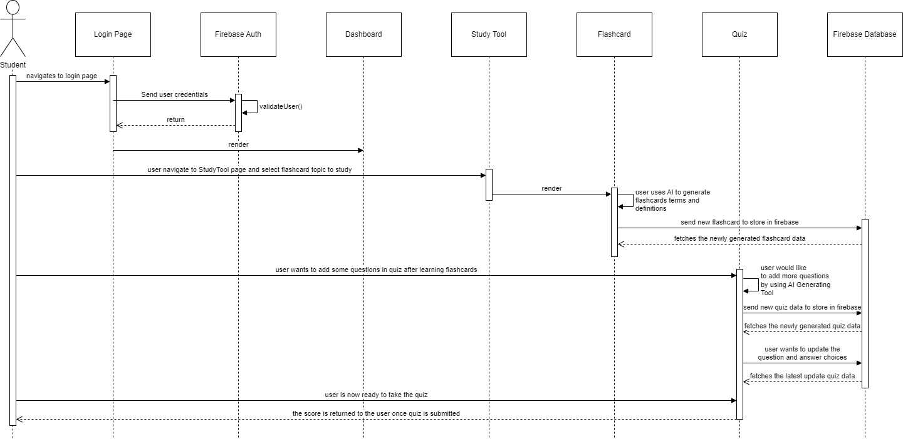

## Frontend

The StudySync platform is designed to enhance students' learning experiences by providing a centralized dashboard for streamlined access to educational resources. With an emphasis on collaboration and efficiency, it facilitates AI-powered creation of flashcards and quizzes, fostering an interactive learning environment. Students can effortlessly share these resources with friends, enriching the collective study process. Additionally, StudySync allows users to schedule study sessions, ensuring consistent and focused learning engagements.

## Dashboard Component & Mysets Component & Social Component & Profile Component 

The image shows the react component that make the dashboard page, mysets page, social page and profile page. These components interact with the userRepository class to fetch the data from database.

### Dashboard 
Dashboard component uses the methods inside the userRepository to fetch the data from database and all the other database operation, it displays the upcoming events, friends, recent flashcards and recent quizzes.

### Mysets
Mysets component uses the methods inside the userRepository to fetch the data from database and all the other database operation, it displays flashcards and  quizzes and allow user to share them. ScheduleDialog will allow user to set the time to study.

### Social
Social component uses the methods inside the userRepository to fetch the data from database and all the other database operation, it displays user's following and followers. This page also allow user to find users.

### Profile

Profile component uses the methods inside the userRepository to fetch the data from database and all the other database operation, it displays user's information. User can edit its own information here or click on the flashcards to redirect to the flashcard component.

## Flashcard Component

Here is the flashcard component. It uses the methods inside the flashcardRepo to fetch the data from database and all the other database operation. User can create a flashcard set here. And then click the flashcard button to redirect the flashcardUICom. This is the component where user can create and study their flashcards.

## Quiz Component

Here is the Quiz component. It uses the methods inside the QuizRepository to fetch the data from database and all the other database operation. QuizList allows user to create multiple quizzes for one flashcard set. MainQuizPage allows user to actual take the quiz.

## Events Component

Here is the Event component. It uses the methods inside the EventRepository to fetch the data from database and all the other database operation. User can edit upcoming events in the page. EventCard is the style of each event.

## Leaderboard Component

Here is the leaderboard component. It uses the methods inside the QuizRepository to fetch the data from database and all the other database operation. User can see the score comparison here.

## Notificatin Component

Here is the notification component. It uses the methods inside the NotificationRepository to fetch the data from database and all the other database operation. NotificationBadge styles the notification page. Users will receive notifications for various interactions such as following or unfollowing a user, sharing flashcards or quizzes, and reminders for upcoming events.

## Backend
StudySync, an innovative learning platform, seamlessly integrates Firebase's robust features to deliver an engaging user experience. Its use of Firebase hosting ensures rapid content delivery and secure hosting, while Firebase Cloud Functions allow for efficient serverless back-end operations. This harmonious integration provides users with real-time access to study tools and a responsive platform that adapts to their interactive needs.

Beyond smooth operations, Firebase's advanced capabilities also include real-time database updates and secure user authentication, contributing to a cohesive ecosystem. StudySync users benefit from a dynamic platform where learning materials are instantly accessible, interactions are safeguarded, and updates are immediately reflected, all thanks to Firebase's comprehensive suite of tools that underpin the platform's performance and reliability.

## Database
#### Database Model

StudySync will be using a Firebase NoSQL database to store all data. The database will be made up of the following collections: 
- **User**: This collection stores everything related to a single user. 
- **Notifications**: Stores all the metadata related to a notification
- **Event**: Store metadata for each event
- **FlashCard**: Representation of an entire stack of flashcards. Made up of flashcard items
- **FlashCardItem**: A single flash card
- **Quiz**: A quiz object generated based on a flash card.
- **EventType**: This is a static list of different types of events. 

For single properties on a user model such as email, password and name, we will just store it in the user the corresponding collection. For more complex properties such as notifications, followers and following, flashcards and events, we will store the ids of each corresponding field in the user collection and query the respective collection as needed. To be more specific, in the case of notifications, the actual data for notifications will be stored in the Notifications collections, anytime we need to query user notifications, we can do this easily by fetching all the notification ids for that user from the Users collection and then querying the Notifications collection using those ids. This same idea applies to fetching events for Notifications

## Use case 1
A user forgets to review because of daily chores and uses StudySync to review before midterm is approaching.

1. User login using Google api.
2. After logging into the account, the user finds the study outline.
3. Then he found the flash cards for his subject.
4. Next the user will proceed to flash Select Q&A mode.
5. Finally, the user completes the quiz and the correct answer is displayed.
6. The last wrong questions will be collected and then these questions will be saved in a new topic.

  

## Use case 2
A user is about to take a naturalization test but doesn't have time to study for it due to work, so he needs to practice for the test using StudySyne.

1. The user opens the website and enters their account credentials to log in.
2. Then, because there is no content they need to study on StudySync, they have to input their own questions.
3. Afterward, they add the citizenship test questions they've learned to StudySync.
4. Once the question bank upload is complete, they choose flashcards for memory training.
5. When flashcards appear, there are three options: recognize, don't recognize, and unsure.
6. Finally, in the next practice session, the questions they didn't recognize will be added to a quiz and continue to appear in the subsequent exercises.

## Use case 3
  A user was recommended a learning program by his classmates that said he could have a quiz competition.

1. He opened the website his classmate gave him and created the account password.
2. Then he went to the friends list and chose to add a friend.
3. After adding his friends he received an invitation to a quiz contest sent to him by his classmate.
4. After completing the quiz the scores and rankings of the inviter as well as all invited people appeared.

## Use case 4
  A user wants to study the subject he wants but, he doesn't find the flash card for the subject he wants in StudySync.

1. He opened StudySync and automatically logged in
2. After he didn't find a flash card for the subject he wanted to study he turned on the AI topic generation function
3. After pressing AI Flash Card Generator you will first see all the flash cards and you can filter them.
4. After completing the screening you can study, then while flash card studying you are not satisfied with a particular topic then choose to be dissatisfied with that topic.
5. The question will then be deleted from the pool.

## Use case 5
   A user wants to take a quiz created by themselves or a friend.

1. User logs in to StudySync.
2. User then navigate to the "Quiz" section.
3. At the "Quiz" section, user has a wide range of quizzes either created by themselves or friends.
4. Then the user completes the quiz and submits their answers.
5. The system will then calculate and the display user's score on the leaderboard.

## Use case 6
   A user wants to add friends on StudySync.

1. User will have to log in to their own account.
2. Then navigate to the "Add Friend" section.
3. User enters the friend's email or username.
4. Once the friend's name popup, user recognizes their friends then clicks "add as friend".
5. The friend receives the friend request and is able to accept or reject it.

## Use case 7
   A user has been studying for 6 hours and wants to take a break but also wants to save the quiz's progress.

1. User is taking a quiz but then realizes he/she wants to take a quick coffee break.
2. User clicks "Save&Exit" button in order for the quiz to be saved and quit.
3. The system saves the user's progress.
4. After the break, the user logs in and goes to the "Quiz" section to resume the paused quiz.
5. User chooses to resume the quiz from where they left off.

## Use case 8
  A user finds out some flashcards need to be updated in order to improve accuracy.

1. User logs in to StudySynce as usual.
2. Then user has to go to their created flashcards.
3. User finds out which flashcards need to be updated.
4. User makes some changes to the flashcard definition and details.
5. User saves changes and then flashcards are updated and ready to be learned.

